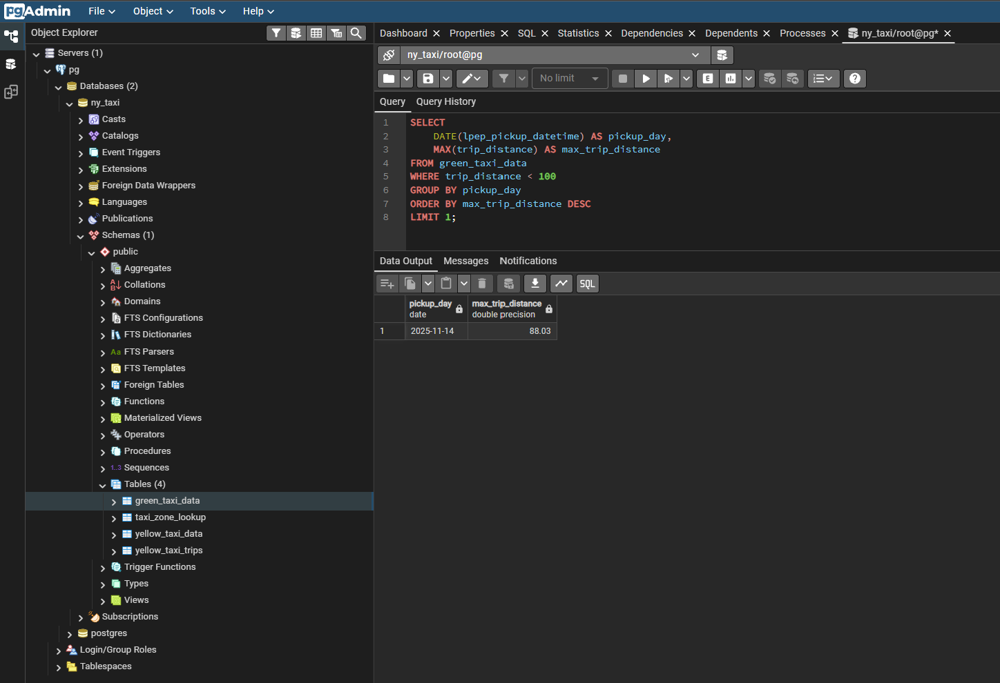
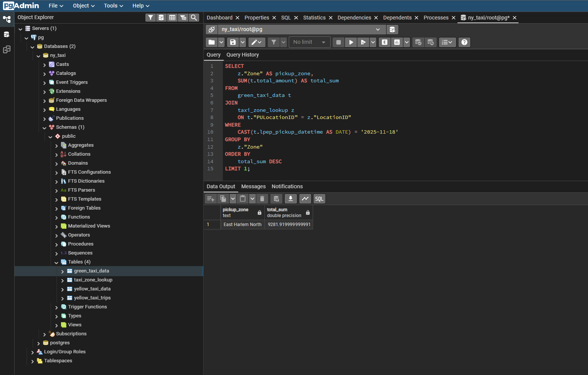
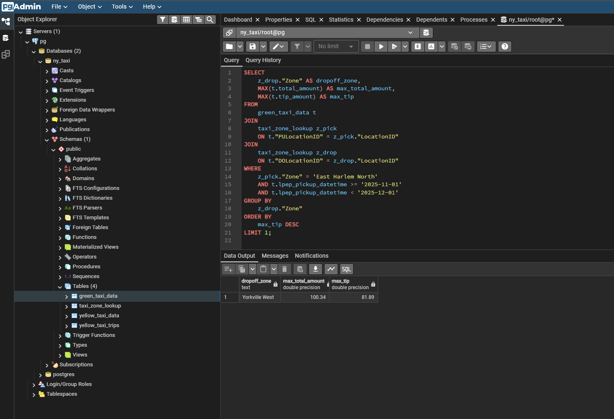

Question 1:


### Question 3:
```SQL
SELECT COUNT(*) 
SELECT COUNT(*) 
FROM green_taxi_data
WHERE lpep_pickup_datetime >= '2025-11-01'
  AND lpep_pickup_datetime < '2025-12-01'
  AND trip_distance <= 1;
```


### Question 4:
```SQL
SELECT 
    DATE(lpep_pickup_datetime) AS pickup_day,
    MAX(trip_distance) AS max_trip_distance
FROM green_taxi_data
WHERE trip_distance < 100
GROUP BY pickup_day
ORDER BY max_trip_distance DESC
LIMIT 1;
```



### Question 5:
```SQL
SELECT 
    z."Zone" AS pickup_zone,
    SUM(t.total_amount) AS total_sum
FROM 
    green_taxi_data t
JOIN 
    taxi_zone_lookup z 
    ON t."PULocationID" = z."LocationID"
WHERE 
    CAST(t.lpep_pickup_datetime AS DATE) = '2025-11-18'
GROUP BY 
    z."Zone"
ORDER BY 
    total_sum DESC
LIMIT 1;
```



### Question 6:
```SQL
SELECT 
    z_drop."Zone" AS dropoff_zone,
    MAX(t.total_amount) AS max_total_amount,
    MAX(t.tip_amount) AS max_tip
FROM 
    green_taxi_data t
JOIN 
    taxi_zone_lookup z_pick
    ON t."PULocationID" = z_pick."LocationID"
JOIN 
    taxi_zone_lookup z_drop
    ON t."DOLocationID" = z_drop."LocationID"
WHERE 
    z_pick."Zone" = 'East Harlem North'
    AND t.lpep_pickup_datetime >= '2025-11-01'
    AND t.lpep_pickup_datetime < '2025-12-01'
GROUP BY 
    z_drop."Zone"
ORDER BY 
    max_tip DESC
LIMIT 1;
```
