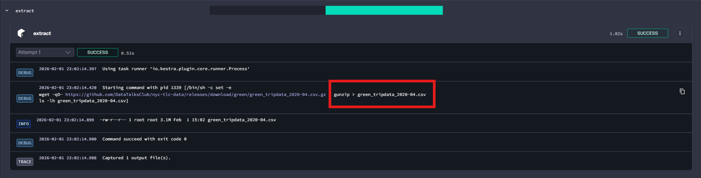
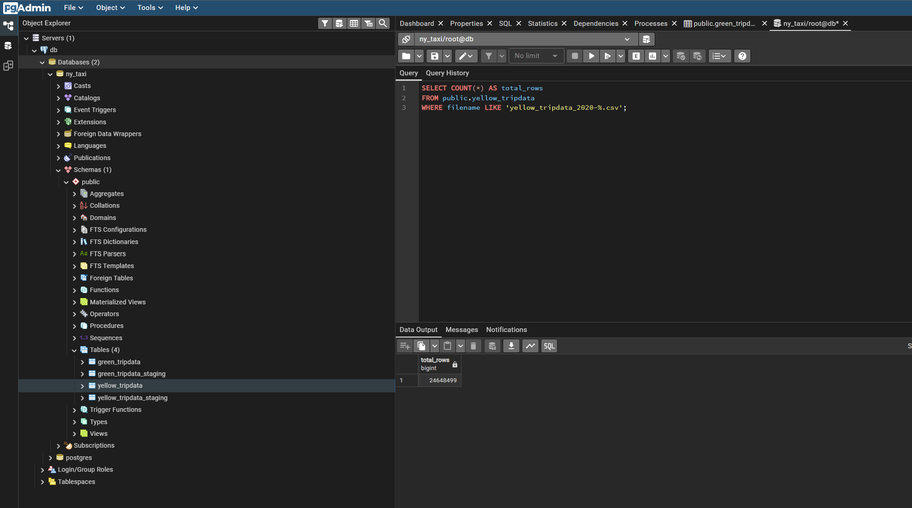
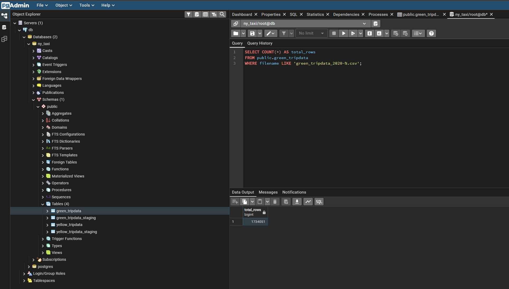
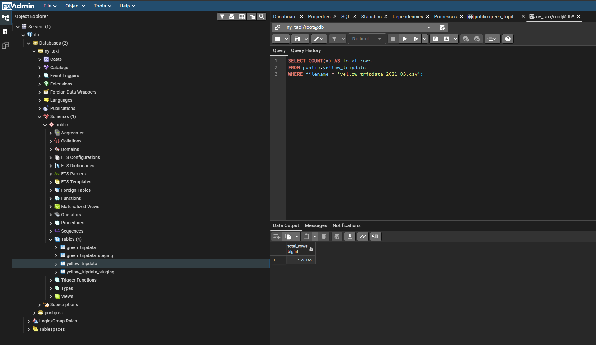

### Question 1:

I used an additional command(  - ls -lh {{render(vars.file)}}) in the commands inside the *extract* so I can see the file size in the logs.


**Logs**
```
INFO 2026-02-01T14:50:11.153455Z -rw-r--r-- 1 root root 129M Feb  1 14:50 yellow_tripdata_2020-12.csv
```

Answer is close to **128.3 MiB**.


### Question 2:



**Logs**
```
DEBUG 2026-02-01T15:02:14.420624Z Starting command with pid 1339 [/bin/sh -c set -e
wget -qO- https://github.com/DataTalksClub/nyc-tlc-data/releases/download/green/green_tripdata_2020-04.csv.gz | gunzip > green_tripdata_2020-04.csv
ls -lh green_tripdata_2020-04.csv]
```


### Question 3:

Used backfill execution to for fetching data for the whole 2020 year.

```SQL
SELECT COUNT(*) AS total_rows
FROM public.yellow_tripdata
WHERE filename LIKE 'yellow_tripdata_2020-%.csv';
```




### Question 4:

Same approach as Question 3 but for green taxi trips.

```SQL
SELECT COUNT(*) AS total_rows
FROM public.yellow_tripdata
WHERE filename LIKE 'yellow_tripdata_2020-%.csv';
```




### Question 5:

```SQL
SELECT COUNT(*) AS total_rows
FROM public.yellow_tripdata
WHERE filename = 'yellow_tripdata_2021-03.csv';
```

