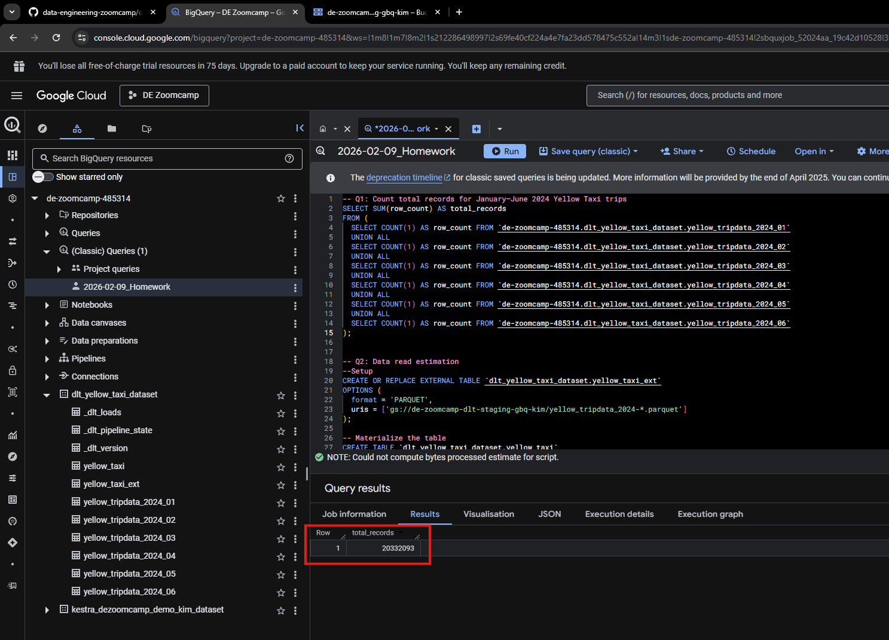
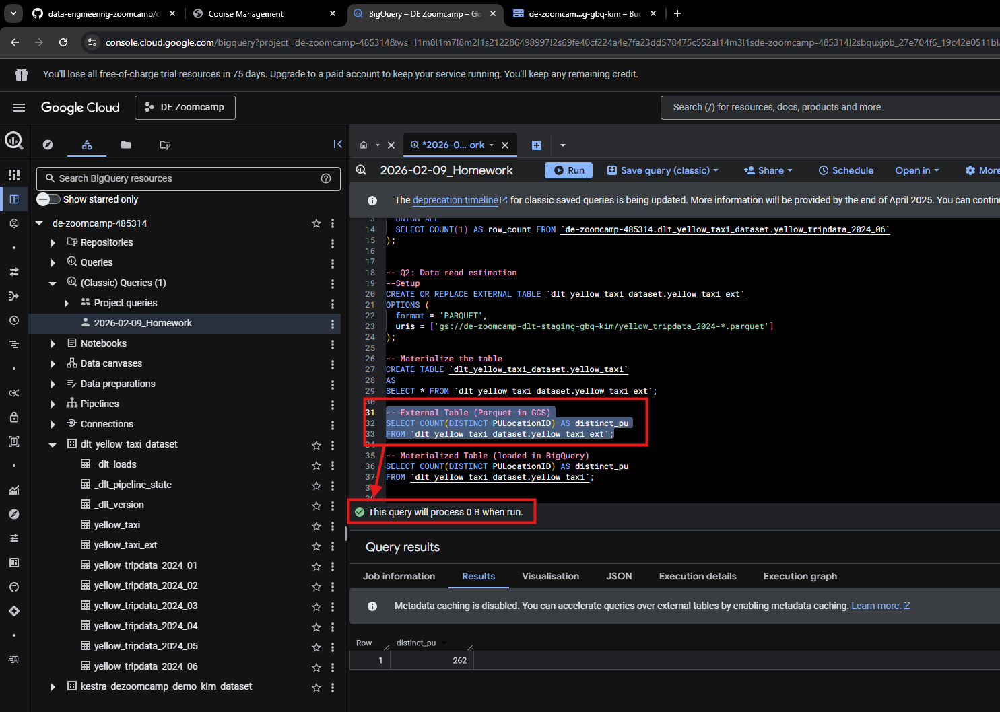
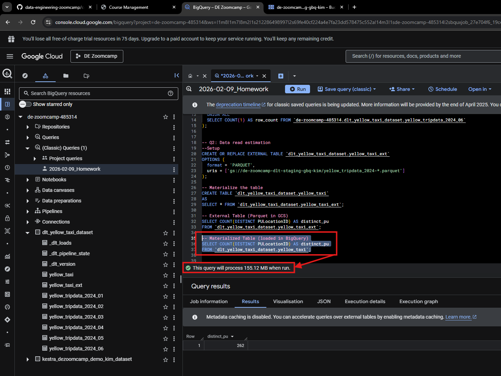
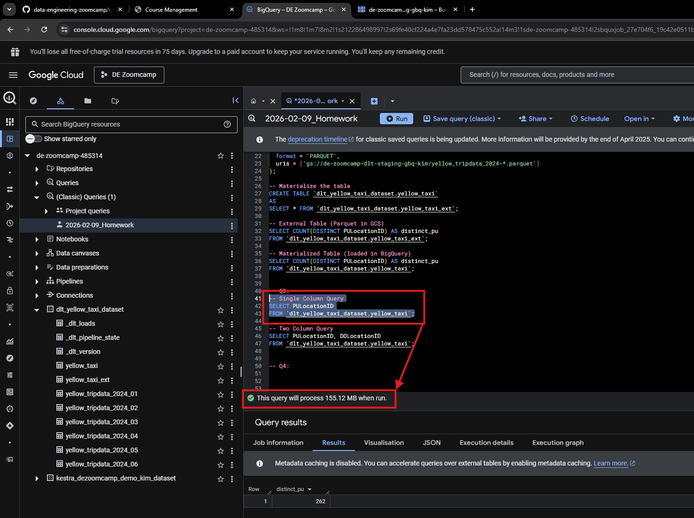
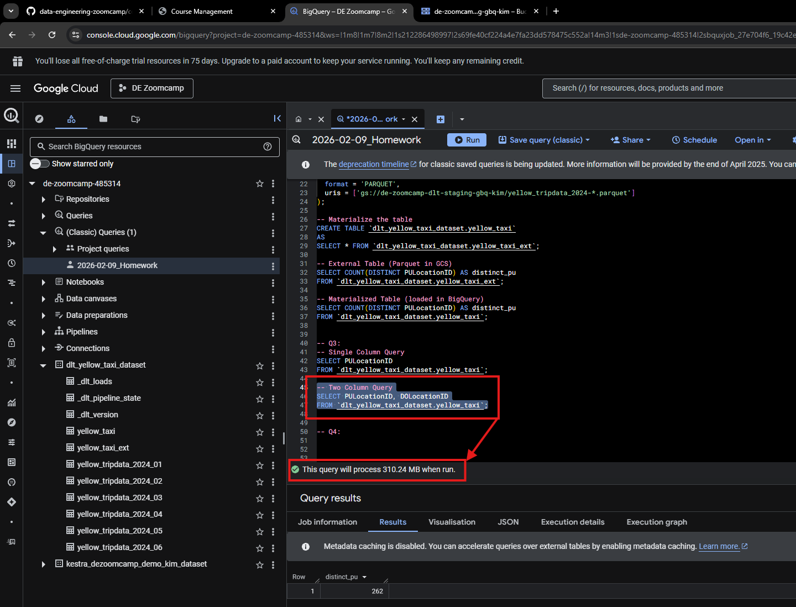
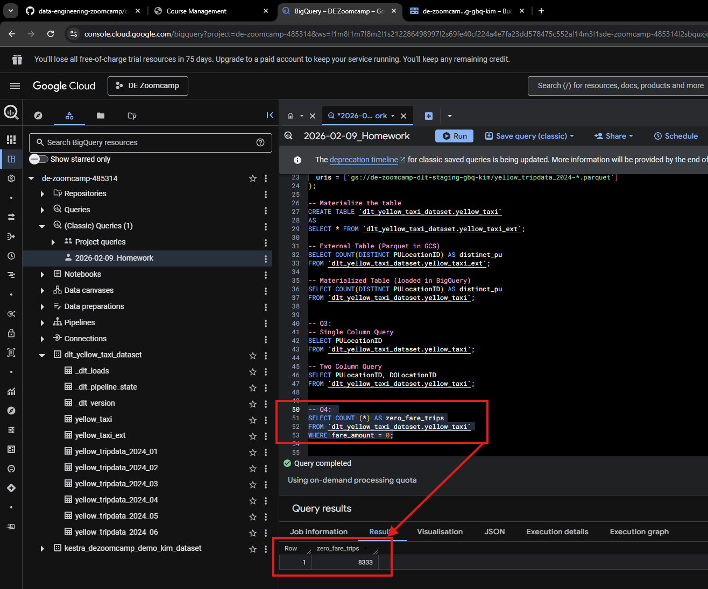
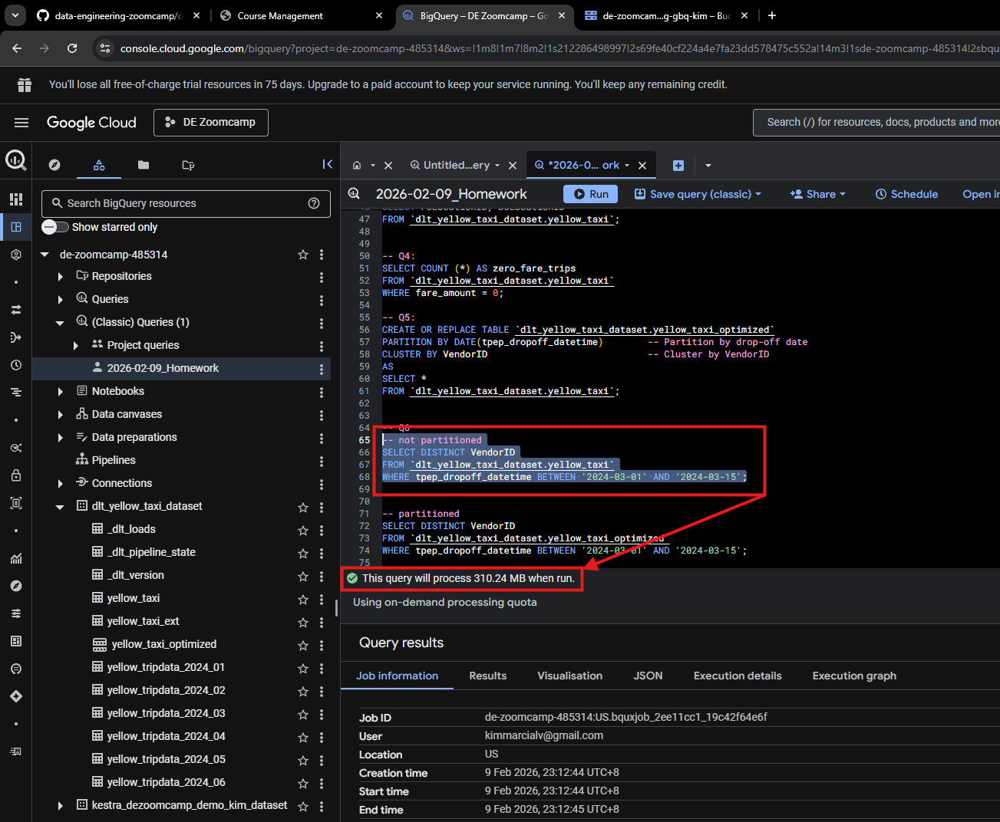
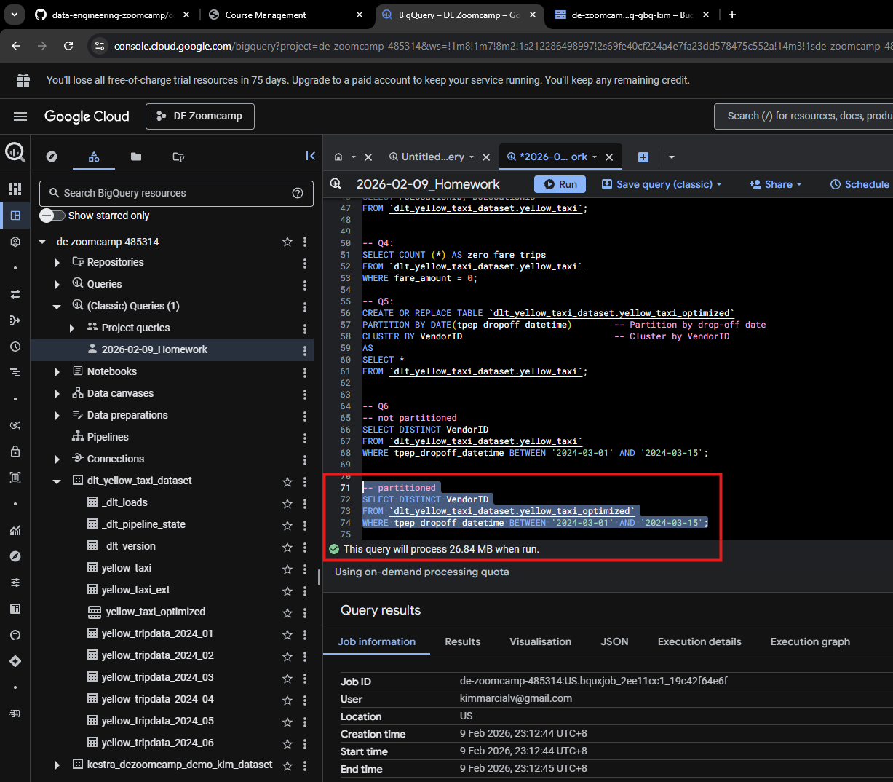

## Setup

In this homework NYC Yellow Trip Records from January 2024 to June 2024 needs to be loadded into a GCS bucket and Bigquery.

I used the *load_taxi_trips_GCS.py* to load and stage the data in a bucket named de-zoomcamp-dlt-staging-gbq-kim.

After that I then used a DLT approach with a slightly modified *DLT_Load_Taxi_Trips_GBQ.ipynb* to load the same data but the destination this time is to Bigquery and I named the dataset as dlt_yellow_taxi_dataset.

### Question 1:

```SQL
-- Q1: Count total records for January–June 2024 Yellow Taxi trips
SELECT SUM(row_count) AS total_records
FROM (
  SELECT COUNT(1) AS row_count FROM `de-zoomcamp-485314.dlt_yellow_taxi_dataset.yellow_tripdata_2024_01`
  UNION ALL
  SELECT COUNT(1) AS row_count FROM `de-zoomcamp-485314.dlt_yellow_taxi_dataset.yellow_tripdata_2024_02`
  UNION ALL
  SELECT COUNT(1) AS row_count FROM `de-zoomcamp-485314.dlt_yellow_taxi_dataset.yellow_tripdata_2024_03`
  UNION ALL
  SELECT COUNT(1) AS row_count FROM `de-zoomcamp-485314.dlt_yellow_taxi_dataset.yellow_tripdata_2024_04`
  UNION ALL
  SELECT COUNT(1) AS row_count FROM `de-zoomcamp-485314.dlt_yellow_taxi_dataset.yellow_tripdata_2024_05`
  UNION ALL
  SELECT COUNT(1) AS row_count FROM `de-zoomcamp-485314.dlt_yellow_taxi_dataset.yellow_tripdata_2024_06`
);
```

After loading the data and running the query the results returned **20332093**.




### Question 2:

```SQL
--Setup
CREATE OR REPLACE EXTERNAL TABLE `dlt_yellow_taxi_dataset.yellow_taxi_ext`
OPTIONS (
  format = 'PARQUET',
  uris = ['gs://de-zoomcamp-dlt-staging-gbq-kim/yellow_tripdata_2024-*.parquet']
);

-- Materialize the table
CREATE TABLE `dlt_yellow_taxi_dataset.yellow_taxi`
AS
SELECT * FROM `dlt_yellow_taxi_dataset.yellow_taxi_ext`;
```

#### External Table
```SQL
-- External Table (Parquet in GCS)
SELECT COUNT(DISTINCT PULocationID) AS distinct_pu
FROM `dlt_yellow_taxi_dataset.yellow_taxi_ext`;
```
When executing the external table this will return 0 B when executed.



#### Materialized Table

```SQL
-- Materialized Table (loaded in BigQuery)
SELECT COUNT(DISTINCT PULocationID) AS distinct_pu
FROM `dlt_yellow_taxi_dataset.yellow_taxi`;
```
When executing the external table this will return 155.12 MB when executed.




### Question 3:

```SQL
-- Single Column Query
SELECT PULocationID
FROM `dlt_yellow_taxi_dataset.yellow_taxi`;

-- Two Column Query
SELECT PULocationID, DOLocationID
FROM `dlt_yellow_taxi_dataset.yellow_taxi`;
```
So, BigQuery stores data column-wise, not row-wise. When querying only one column, BigQuery reads just that column from storage. Therefore the more columns being read the higher the bytes to process.






### Question 4:
```SQL
SELECT COUNT (*) AS zero_fare_trips
FROM `dlt_yellow_taxi_dataset.yellow_taxi`
WHERE fare_amount = 0;
```




### Question 5:

```SQL
CREATE OR REPLACE TABLE `dlt_yellow_taxi_dataset.yellow_taxi_optimized`
PARTITION BY DATE(tpep_dropoff_datetime)        -- Partition by drop-off date
CLUSTER BY VendorID                             -- Cluster by VendorID
AS
SELECT *
FROM `dlt_yellow_taxi_dataset.yellow_taxi`;
```


### Question 6:

#### Not Partioned
```SQL
-- not partitioned
SELECT DISTINCT VendorID
FROM `dlt_yellow_taxi_dataset.yellow_taxi`
WHERE tpep_dropoff_datetime BETWEEN '2024-03-01' AND '2024-03-15';
```
When executing the external table this will return 310.24 MB when executed.



#### Partioned

```SQL
-- partitioned
SELECT DISTINCT VendorID
FROM `dlt_yellow_taxi_dataset.yellow_taxi_optimized`
WHERE tpep_dropoff_datetime BETWEEN '2024-03-01' AND '2024-03-15';
```
When executing the external table this will return 26.84 MB when executed.

