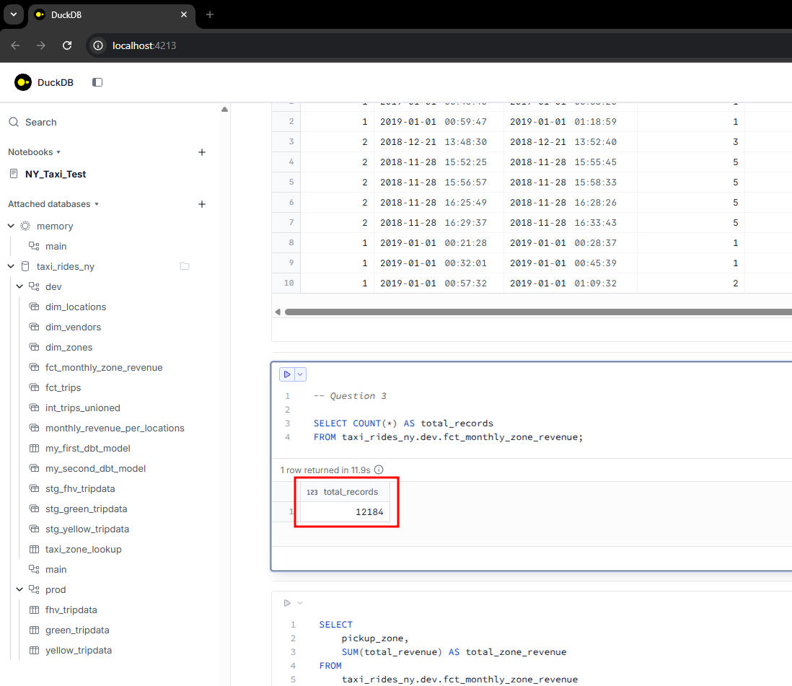
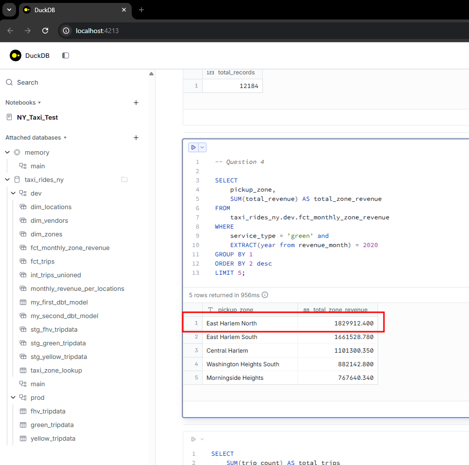
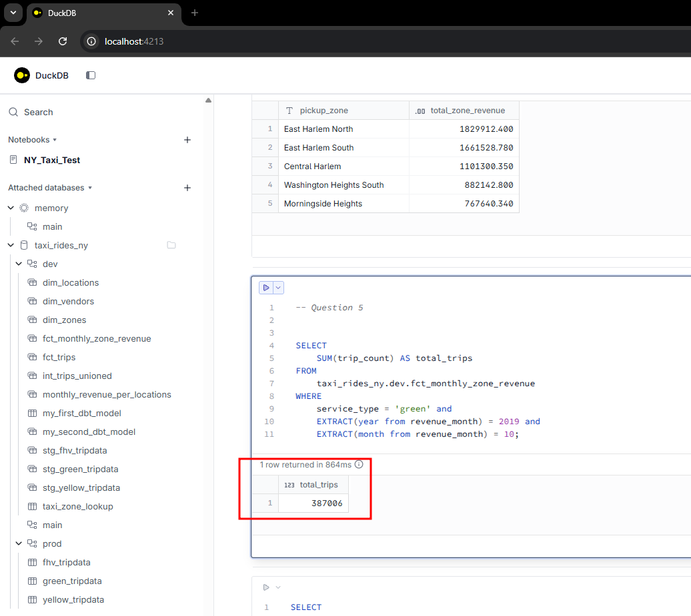
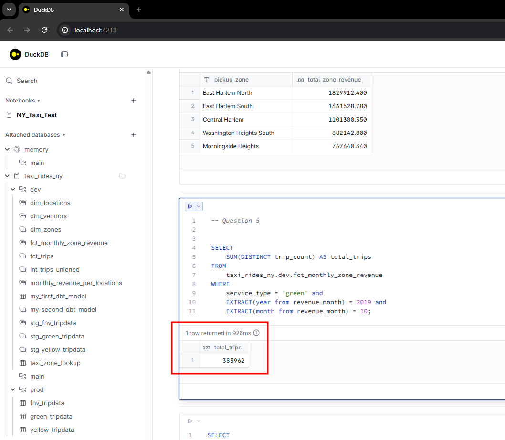
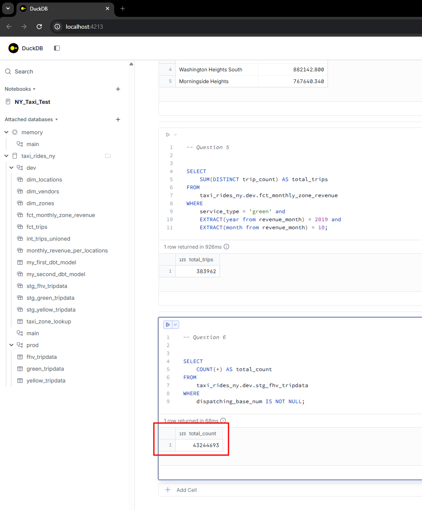

## Setup

In this module I followed the local setup using dbt with duckdb.

### Question 1:

dbt run --select int_trips_unioned builds  **int_trips_unioned only**.

### Question 2:

New value 6 appears in payment_type. What happens on dbt test is that **dbt will fail the test, returning a non-zero exit code**.

### Question 3:

```SQL
SELECT COUNT(*) AS total_records
FROM taxi_rides_ny.dev.fct_monthly_zone_revenue;
```

The total count of records in the fct_monthly_zone_revenue model is **12,184**.




### Question 4:
```SQL
SELECT
    pickup_zone, 
    SUM(total_revenue) AS total_zone_revenue
FROM  
    taxi_rides_ny.dev.fct_monthly_zone_revenue
WHERE 
    service_type = 'green' and 
    EXTRACT(year from revenue_month) = 2020
GROUP BY 1
ORDER BY 2 desc
LIMIT 5;
```

The zone with highest revenue for green taxis in 2020 is **East Harlem North**.




### Question 5:
```SQL
SELECT 
    SUM(trip_count) AS total_trips
FROM 
    taxi_rides_ny.dev.fct_monthly_zone_revenue
WHERE 
    service_type = 'green' and 
    EXTRACT(year from revenue_month) = 2019 and 
    EXTRACT(month from revenue_month) = 10;
```

The Total trips for Green taxis in October 2019 is **384,624**. However in my query based on the model generated it actually resulted in *387,006* which is close to 384,624. I also tried using SUM(DISTINCT trip_count) AS total_trips and it resulted in *383,962*. I don't like that my answer will be simply based on "result of my query and choose option closes to it" but I need to double check on another time.






### Question 6:
```SQL
SELECT 
    COUNT(*) AS total_count 
FROM 
    taxi_rides_ny.dev.stg_fhv_tripdata
WHERE 
    dispatching_base_num IS NOT NULL;
```

As setup here I needed to create ingest_fhv.py to load the fhv tripdata into duckdb and create the stg_fhv_tripdata staging model. The total count of records for the stg_fhv_tripdata **43,244,693**.

