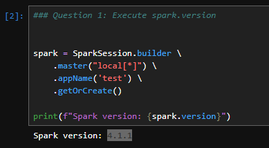
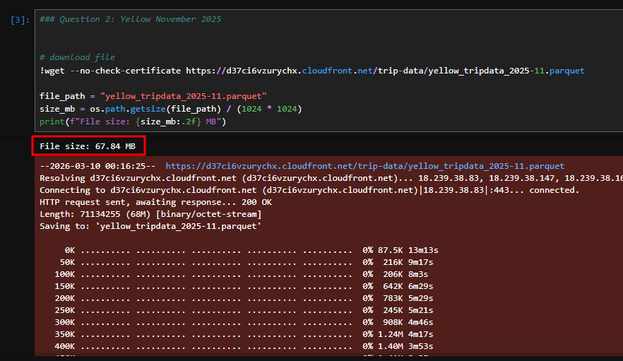
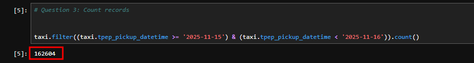
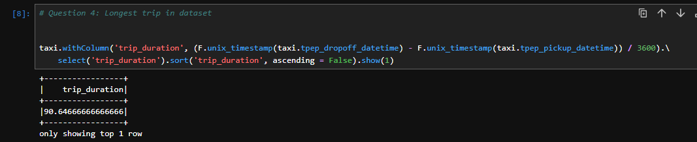
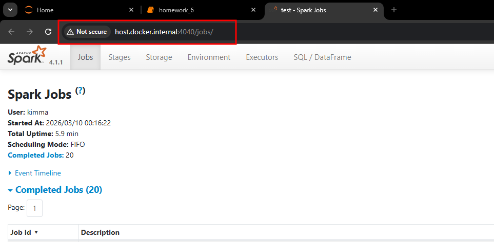
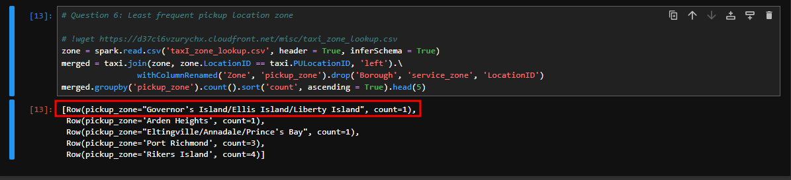

### Question 1

When execute spark.version is done my current version of spark is **4.1.1**

### Question 2

When downloading the Yellow November 2025 the file size is **67.84 MB** which is sclose to 75 M.B.
I had to use a VPN to download the file since my network is blocking cloudfront which prohibited me to execute the wget command to download the file. Also should have changed the appName I forgot.

### Question 3

A total count of **162,604** taxi trips were there on the 15th of November.

### Question 4

The length of the longest trip in the dataset is **90.64 hours**.

### Question 5

The Spark UI runs the application dashboard on local port **4040**.

### Question 6

**Governor's Island/Ellis Island/Liberty Island** is the zone with the least frequent pickup location.

