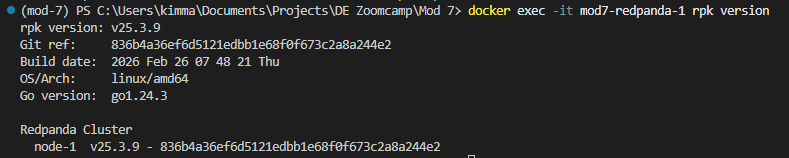
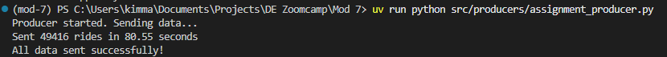
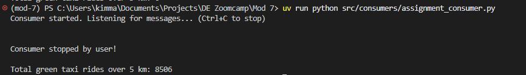
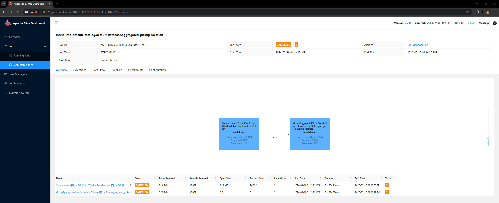
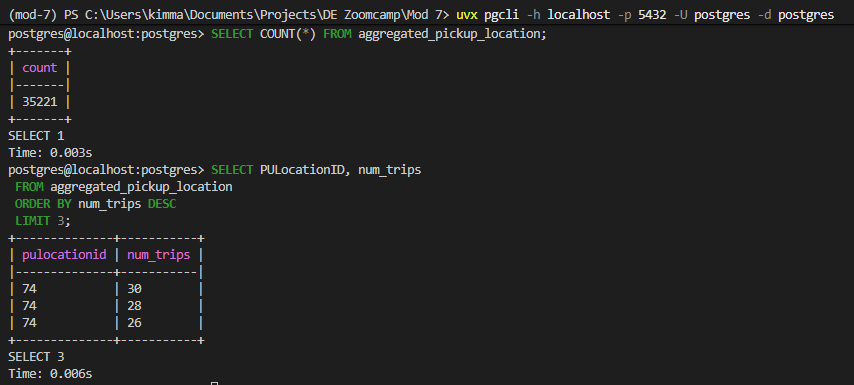
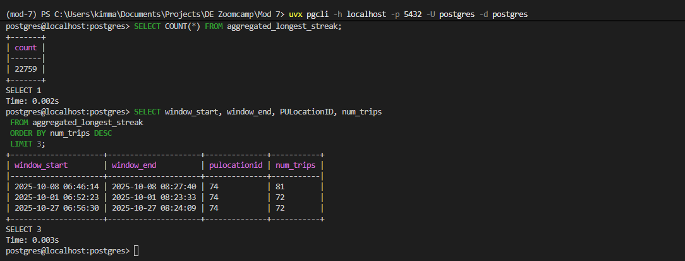
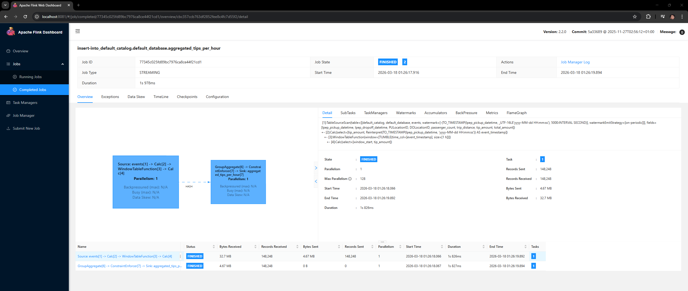
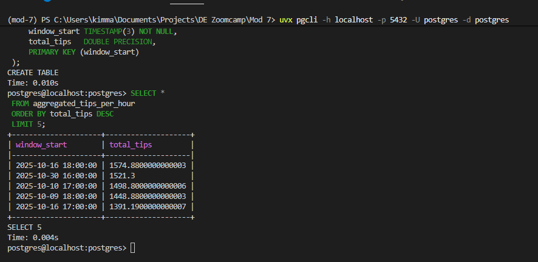

### Question 1

Using the ```docker exec -it workshop-redpanda-1 rpk version``` command. The current version of Redpanda I'm running is **v25.3.9**.




### Question 2

Using the ```assignment_producer.py``` for sending the data, I set the delay to *0.001* inside the send_rides_fast fundction and it took around **80.55 seconds** for me. The answer is close to **60 seconds** so I'll be choosing that as my answer.




### Question 3

Using the ```assignment_consumer.py``` for reading the messages sent by the ```assignment_producer.py```. The total number of trips with a trip_distance above 5 is **8506**.




### Question 4

Setting up the pyflink job using ```assignment_puloc5_job.py``` with a tumbling window for determining the pickup location. The PULocationID which had the most trips in a single 5-minute window was **74**.

I had to rerun this 3 to 4 times as the job would not initialize for me and it will say "Restarting" then it will fail. What worked for me is rebuilding the and rerunning all the commands.

```SQL
-- Q4 Creation of table in postgres
CREATE TABLE aggregated_pickup_location (
    window_start TIMESTAMP(3) NOT NULL,
    PULocationID INT NOT NULL,
    num_trips BIGINT,
    PRIMARY KEY (window_start, PULocationID)
);
```






### Question 5

The pyflink job using ```assignment_lsreak_job.py``` was setup with a session window for determining the longest streak. The total number of trips in the longest session was **81**.

```SQL
-- Q5 Creation of table in postgres
CREATE TABLE aggregated_longest_streak (
    window_start TIMESTAMP(3) NOT NULL,
    window_end   TIMESTAMP(3) NOT NULL,
    PULocationID INT NOT NULL,
    num_trips    BIGINT,
    PRIMARY KEY (window_start, window_end, PULocationID)
);
```





### Question 6

Setting up the pyflink job using ```assignment_aggtips_job.py``` with a tumbling window for determining the largets trip. The hour which had the highest total amount was **2025-10-16 18:00:00**.


```SQL
-- Q6 Creation of table in postgres
CREATE TABLE aggregated_tips_per_hour (
    window_start TIMESTAMP(3) NOT NULL,
    total_tips   DOUBLE PRECISION,
    PRIMARY KEY (window_start)
);
```




