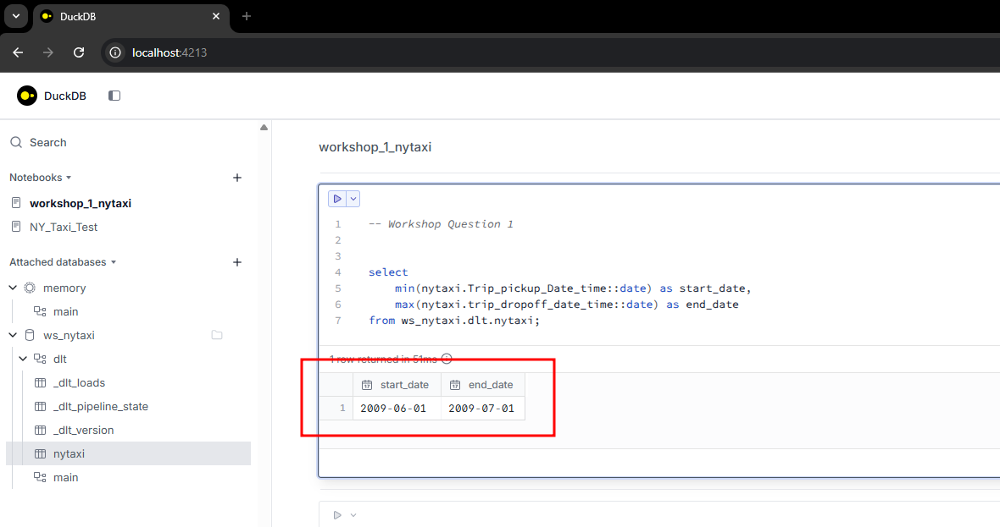
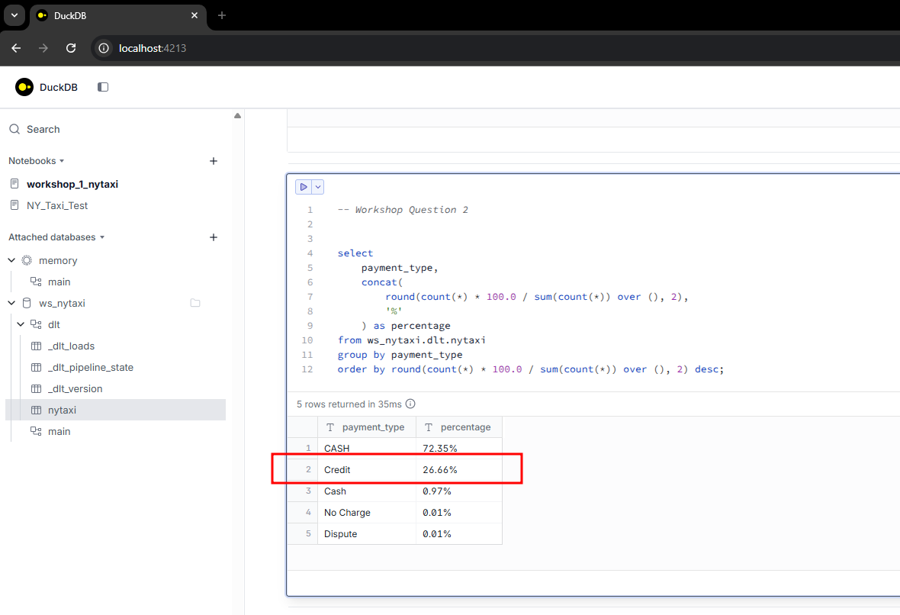
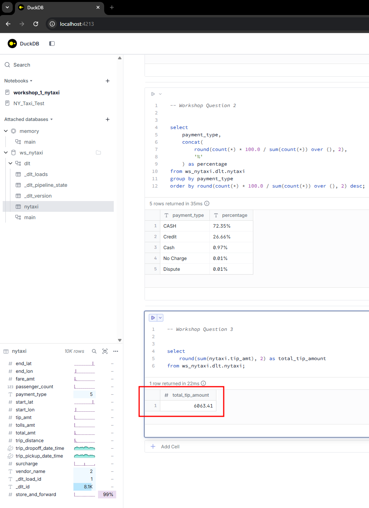

### Question 1

The start date and end date of the dataset is **2009-06-01 to 2009-07-01**.

```SQL
select 
    min(nytaxi.Trip_pickup_Date_time::date) as start_date, 
    max(nytaxi.trip_dropoff_date_time::date) as end_date 
from ws_nytaxi.dlt.nytaxi;
```




### Question 2

The proportion of trips that are paid with credit card is **26.66%**.

```SQL
select 
    payment_type,
    concat(
        round(count(*) * 100.0 / sum(count(*)) over (), 2),
        '%'
    ) as percentage
from ws_nytaxi.dlt.nytaxi
group by payment_type
order by round(count(*) * 100.0 / sum(count(*)) over (), 2) desc;
```




### Question 3

The total amount of money generated in tips is **$6,063.41**.

```SQL
select 
    round(sum(nytaxi.tip_amt), 2) as total_tip_amount 
from ws_nytaxi.dlt.nytaxi;
```

